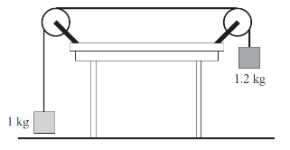

# {{ params.vars.title }}
## Part 1

Two blocks are arranged as shown and kept at rest by holding the {{ params.m1 }} kg block in place.
The tension in the string is **closest** to which of the following choices?

### Answer Section

- {{ params.part1.ans1.value }} {{ params.vars.units}}
- {{ params.part1.ans2.value }} {{ params.vars.units}}
- {{ params.part1.ans3.value }} {{ params.vars.units}}
- {{ params.part1.ans4.value }} {{ params.vars.units}}
- {{ params.part1.ans5.value }} {{ params.vars.units}}
- {{ params.part1.ans6.value }} {{ params.vars.units}}

## Attribution

Problem is licensed under the [CC-BY-NC-SA 4.0 license](https://creativecommons.org/licenses/by-nc-sa/4.0/).  